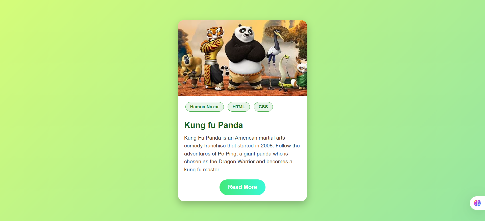

# 🐼 Kung Fu Panda Card

A simple and modern **Kung Fu Panda themed card** built with **HTML & CSS**.  
The card is fully responsive, has hover effects, and includes a **Read More** button that links directly to the official Kung Fu Panda IMDb page.

---

## 📸 Preview



---

## ✨ Features
- 🎨 Modern design with **green Kung Fu theme**
- 🌱 Smooth hover animations
- 📱 Responsive and centered on all screens
- 🔗 "Read More" button linking to [Kung Fu Panda IMDb](https://www.imdb.com/title/tt0441773/)

---

## 📂 Project Structure

```text
project-root/
│-- index.html        # Main HTML file  
│-- style.css         # Stylesheet (inside <style> in this version)  
│-- kung fu.jpg       # Card image  
│-- preview.png       # Project preview image (used in README)  
```

---

## ⚡ How to Run
1. Clone this repository:
   ```bash
   git clone https://github.com/Hamna902/Kung-Fu-Panda-Card.git
2. Open the folder in VS Code (or any editor).

3. Run index.html in your browser.

---

🛠️ Technologies Used

- HTML5

- CSS3 (Flexbox, Gradients, Transitions)

---

🙌 Author

Made by Hamna Nazar 🐼

---

